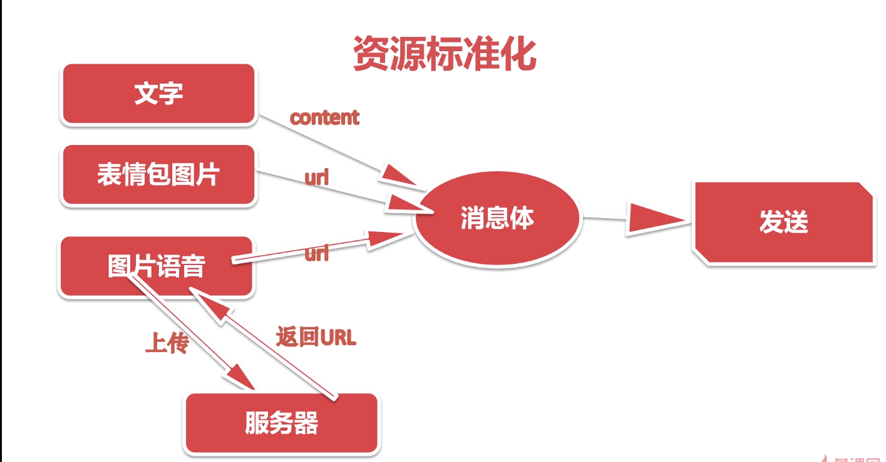
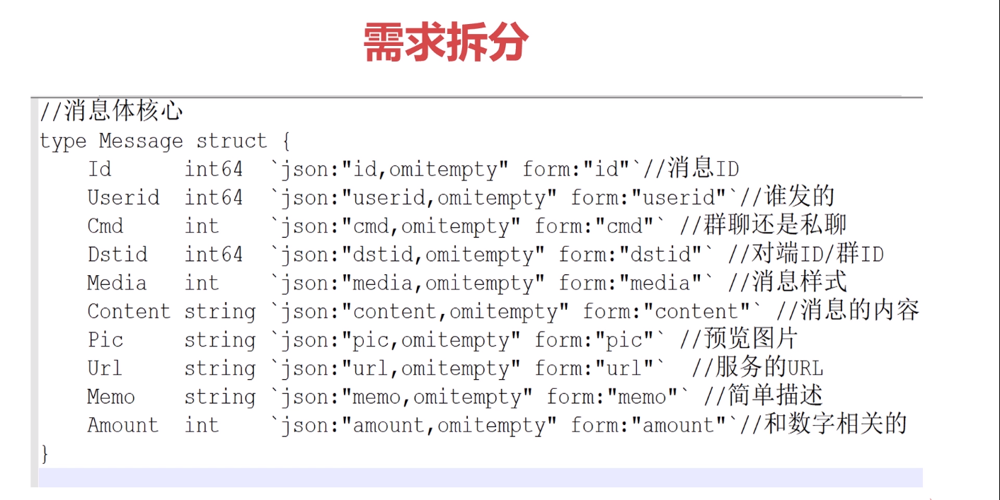
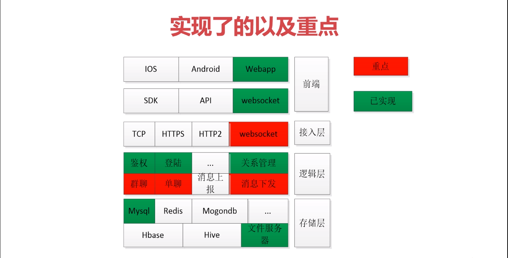
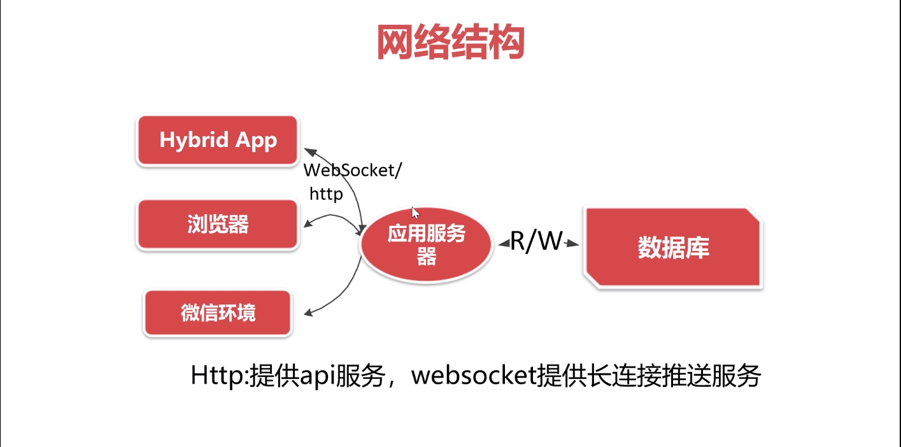

## Go语言打造高并发web即时聊天(IM)应用

需求分析

基本需求

- 发送/接收
- 实现群聊
- 高并发=单机最好+分布式+弹性扩容

1，实现功能界面

2，实现资源标准化编码

-   资源信息采集并标准化。转化成content/url
-   资源编码，终极目标都是拼接一个消息体（Json/xml）

需求拆分

3，确保消息体的可扩展性

-   兼容基础媒介如图片文字语音（Url/Pic/Content/Num）
-   能承载大量新业务，扩张不能对现有业务产生影响
-   红包/打卡/签到等本质上是消息内容不一样

接收需求拆分

4，接收消息并解析显示

-   接收到消息体（Json）并进行解析
-   区分不同显示形式（图片/文字/语音）
-   界面显示自己发的和别人发的

群聊需求拆分
5，群聊的特殊需求

-   基础功能上无区别
-   1条消息多个参与群聊的终端及时接收到
-   服务器流量计算

服务器负载分析

-   A发送图片512K
-   100人在线群人员同时接收到512kb*100=1024kb*50=50M
-   1024个群50M*1024=50G

解决方案

-   使用缩略图（51.2k）提高单图下载和渲染速度
-   提高资源服务并发能力使用云服务（qos/alioss），100ms以内
-   压缩消息体，发送文件路径而不是整个文件

高并发需求拆分

6，高并发

-   单机并发性能最优
-   海量用户分布式部署
-   应对突发事件弹性扩容

IM系统架构

实现重难点

网络结构

